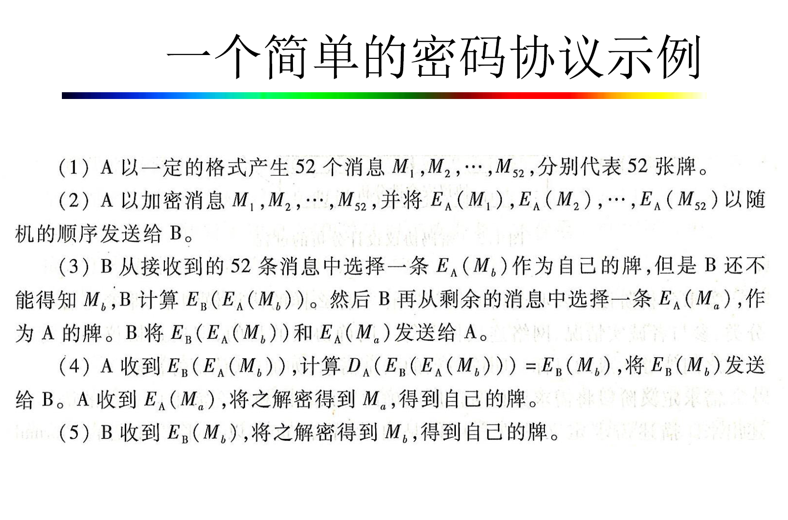

# 1.密码协议引论
### 协议的概念以及含义
两个或者两个以上的参与者为了达到特定的目的而釆取的一系列步骤。
协议规定了一系列有序的步骤。
协议的参与者为两个或以上。
协议有明确的目的，需要完成什么目的。

### 分苹果的公平协议

### 参与者诚实度
诚实：完全按照协议进行
半诚实：只是窃听或者获取其他参与者在协议中的输入。
恶意：不仅窃听，还攻击协议。
### 主动攻击者和被动攻击者
被动攻击者（窃听者）：只窃听或者获取参与者在协议中的输入。
主动攻击者：不仅窃听，还要控制不诚实参与者按照自己设计的方式参与协议。

### Delov-Yao模型
将认证协议本身与认证协议所具体采用的密码系统分开，在假定密码系统是“完美”的基础上讨论认证协议本身的正确性、安全性、冗余性等课题。
### 简单的扑克牌比大小

# 2.公钥基础设施
### 单钥密码和双钥密码
单钥密码（对称钥密码）：算法简单，加解密速度快。密钥管理不便
双钥密码（非对称钥密码）：能公开加密密钥，可用于消息认证。算法一般比较复杂，加密速度慢。

### X.509证书结构
X.509 版本号：指出该证书使用了哪种版本的X.509 标准，版本号会影响证书中的一些特定信息。
证书持有人的公钥：包括证书持有人的公钥、算法的标识符和其他相关的密钥参数。
证书的序列号：由CA 给予每一个证书分配的唯一的数字型编号。
主体信息：证书持有人唯一的标识符(或称DN -distinguished name)这个名字在Internet 上应该是唯一的。
证书的有效期：证书起始日期和时间以及终止日期和时间；指明证书在这两个时间内有效。
认证机构：证书发布者，是签发该证书的实体唯一的CA 的X.500 名字。使用该证书意味着信任签发证书的实体。
发布者的数字签名：这是使用发布者私钥生成的签名，以确保这个证书在发放之后没有被撰改过。
签名算法标识符

### 证书的撤销的原因
密钥泄露
从属变更（某些关于密钥的信息变更，如机构从属变更等）
终止使用
CA本身原因（CA系统泄漏私钥）
CA怀疑证书细节不真实、不可信
证书持有者没有履行其职责和登记人协议
证书持有者死亡、违反电子交易规则或者已经被判定犯罪。

当证书被取消时，实际上是将此证书序列号放入由CA 签发CRL （Certificate Revocation List证书作废表，或证书黑名单表）中，因此序列号是唯一的

# 3.密钥交换协议
密钥交换协议：会话密钥由参与者共同提供参数。
密钥分配协议：会话密钥由一个参与者产生，分配给其他参与者。
混合协议：会话密钥由超过一个参与者产生，分配给其余参与者。
## 简单的密钥协商协议
![[Pasted image 20231202141654.png]]
容易受到中间人攻击（实现让B认为是C发给B的信息，C不需要是合法用户）
![[Pasted image 20231202141736.png]]
C伪装成B与A通信（要求C也是合法用户）
![[Pasted image 20231202143805.png]]
改进：会话密钥与身份信息绑定
![[Pasted image 20231202143947.png]]
重放攻击可以攻击上述协议：（如果C伪装成S，在步骤2发出之前传输过的密钥$K_{AB}^{'}$ ，）
![[Pasted image 20231202144226.png]]
添加随机数抵抗重放攻击
![[Pasted image 20231202155007.png]]
仍然存在问题
![[Pasted image 20231202155019.png]]
最终改进后的安全协议，但是AB不能确定对方是否已经获得正确的密钥
![[Pasted image 20231202155211.png]]
协议的安全性质：
秘密性、数据完整性、数据起源认证性、不可否认性

## 一种反射攻击（反射攻击算是特殊的重放攻击）
![[Pasted image 20231202223051.png]]
## 一种类型攻击
类型攻击原理：实际上通信过程中的信息都是二进制串，因此用户无法判断该信息的具体含义。
![[Pasted image 20231203204027.png]]
以上协议，若第四部攻击者传输的是$M,\{N_A,M,A,B\}_{KAS}$，那么A收到后会把$\{M,A,B\}$成是$K_{AB}$。

## 时间戳和应答两种方法可以抵御重放攻击

## Diffie-Hellman密钥协商交换协议
![[Pasted image 20231121230413.png]]
DL困难问题：已知$g^{r_A}$ ，求$r_A$。
CDH困难问题已知$g^a,g^b$，求$g^{ab}$。

以上协议存在中间人攻击
![[Pasted image 20231203211122.png]]

## 证书操纵
有以下协议：
Cert(A)中包含了A的公钥$g^a$,a只有A本人持有，Cert(B)同理。
A->B:    $g^x,Cert(A)$
B->A:    $g^y,Cert(B)$
确定的$K_{AB}=(g^y)^a \cdot (g^b)^x=(g^x)^b \cdot (g^a)^y=g^{ax+by}$

那么可能存在以下证书操纵攻击：
$C_B$表示攻击者C伪装成B,$Cert(C)=(g^a)^c=g^{ac}$
A->$C_B$:    $g^x,Cert(A)$
C->B:      $g^x,Cert(C)$
B->C:      $g^y,Cert(B)$
$C_B$->A:    $g^{cy},Cert(B)$
对于A来说：最终获得的密钥$K_{AB}=(g^b)^x+(g^cy)^a=g^{acy+bx}$
对于B来说：最终获得的密钥$K_{BC}=(g^x)^b+(g^ac)^y=g^{acy+bx}$
以上攻击操纵了最终生成的密钥相等，C不能知道新生成的密钥的值，仅仅让A以为和B通信，但是B以为在和C通信。

## 基于自证明公钥的密钥交换
同样不需要公钥证书。
![[Pasted image 20231206225523.png]]
**一种基于自证明公钥的密钥交换协议**
![[Pasted image 20231206225944.png]]
最终可知双方共享了$K=g^{{k_A}{x_B}+k_Bx_A}\ mod\ n$
### 如果可信中心在为用户计算公钥时没要求上传秘密指数x
如果上传的不是$(x_A,y_A)$，而是$y_A$。虽然计算时没用到$x_A$，但是协议不安全
E选取一个伪造的$x_A'$，计算出$y_A'=g^{x_A'}\ mod\ n$。
计算$y_E=y_A'+ID_E-ID_A$，并提交$y_E,ID_E$给可信中心。
可信中心计算$Pub_E=(y_A'-ID_A)^{d}\ mod\ n=(y_E-ID_E)^{d}\ mod\ n$
所以可知$Pub_E$同时也可以认为是$Pub_A'$
如果E在AB进行交互时进行如下攻击
![[Pasted image 20231206232113.png]]
那么最后$K_A=g^{k_Ax_B+k_Bx_A}$，而$K_B=g^{k_A'x_B+k_Bx_A'}$。

## 基于身份的密钥交换
特点:基于双线性对映射，由TA为用户生成私钥。
### 一个基于身份的非交互式密钥分配体制
![[Pasted image 20231207190357.png]]
$K_{AB}=e(Q_A,Q_B)^s$
两个局限性：双方共享的密钥$K_{AB}$是静止的。
### 基于身份的两方密钥交换
![[Pasted image 20231207191135.png]]
![[Pasted image 20231207192029.png]]

## 群组密钥交换
### 三方密钥交换
![[Pasted image 20231207192213.png]]
$K=g^{abc}$
但是以上方案很容易受到攻击，因为缺乏认证机制
一轮交换实现三方密钥交换
![[Pasted image 20231207192635.png]]
$K=e(bP,cP)^a=e(P,P)^{abc}$
#### 多方（四方以上）
![[Pasted image 20231207195623.png]]
问题：效率低下，进行n-1轮，计算n个模数。
![[Pasted image 20231207200508.png]]
最后得到的$K=g^{x_1x_2+x_2x_3+...+x_nx_1}$
**群密钥交换协议需要考虑协议的动态性**：因为群成员容易变化，需要满足离开后的成员无法获得后续的密钥，新加入的成员无法获得先前的密钥。

# 4.经典认证协议
## NSPK协议
### 协议内容
![[Pasted image 20231205135755.png]]
### lowe攻击
攻击者C伪装成A可以利用A能够解开$E_A(N_A,N_B)$的能力进行攻击。
攻击流程:
1: A->C:  $E_C(N_A,A)$
1'$C_A$->B: $E_B(N_A,A)$
2'B->$C_A$: $E_A(N_A,N_B)$
2C->A:    $E_A(N_A,N_B)$
3A->C:    $E_C(N_B)$
3'$C_A$->B: $E_B(N_B)$

## Otway-Rees协议
### 协议内容
![[Pasted image 20231205142917.png]]
## 类型攻击
### （1）
若len(M||A||B)=len($K_{ab}$),那么存在以下攻击：
P假装成B
1‘A->$P_B$: M,A,B,$\{N_a,M,A,B\}_{K_{as}}$
4'$P_B$->A: M,$\{N_a,M,A,B\}_{K_{as}}$
那么A会误以为密钥为（M||A||B）
### (2)
条件同样为：若len(M||A||B)=len($K_{ab}$)
攻击者P伪装成服务器S：
![[Pasted image 20231205143622.png]]
攻击者将原本的消息重新发回去，即可使得密钥为（M||A||B）

## 对于Otway-REES协议漏洞的改进
### 改进内容
![[Pasted image 20231205160343.png]]
### 改进后仍然存在的问题

存在平行会话攻击，攻击者两次或者更多次执行协议，可能会产生问题。
攻击成功的条件是，需要S对A,B之间时间间隔极短的密钥请求不进行限制。
A->B: A,B,$N_a$
B->P(S): A,B,$N_a$,$n_b$
此时进行并发攻击，同时进行以下
P(B)->S: A,B,$N_a$,$N_p$          S->P(B): $\{N_a,A,B,K_{ab}\}_{K_{ab}}$ $\{N_p,A,B,K_{ab}\}_{K_{bs}}$
P(B)->S: A,B,${N_p}^{'}$,$N_b$          S->P(B): $\{{N_p}^{'},A,B,{K_{ab}}^{'}\}_{K_{ab}}$$\{N_b,A,B,{K_{ab}}^{'}\}_{K_{ab}}$
此时P得到两个可以通过B验证的伪造密文
P(S)->B:$\{N_a,A,B,K_{ab}\}_{K_{ab}}$      $\{N_b,A,B,{K_{ab}}^{'}\}_{K_{ab}}$
B->A: $\{N_a,A,B,K_{ab}\}_{K_{ab}}$

## Andrew安全PRC协议
### 协议内容
A->B:$A,\{N_a\}_{K_{ab}}$ 
B->A:$\{N_a+1,N_b\}_{K_{ab}}$
A->B:$\{N_b+1\}_{K_{ab}}$
B->A:$\{{K_{ab}^{'}},{N_b}^{'}\}_{K_{ab}}$
### 攻击方式
前三步正常进行，攻击者P截获第三步消息后进行攻击
A->B:$A,\{N_a\}_{K_{ab}}$ 
B->A:$\{N_a+1,N_b\}_{K_{ab}}$
A->B:$\{N_b+1\}_{K_{ab}}$
P(B)->A:$\{N_a+1,N_b\}_{K_{ab}}$
如果len($N_a$)=len($K_{ab}$),则攻击能够成功，A会把$N_a+1$当成是新的密钥，虽然攻击者并不知道它是什么。

## 大嘴青蛙协议
### 协议内容
是一个密钥传输协议，对于B来说，密钥仅仅是被分发的。
A->S: A.$\{T_a,B,K_{ab}\}_{K_{as}}$
S->B: $\{T_S,A,K_{ab}\}_{K_{bs}}$
### 攻击方法
通过以下办法，可以一直获得最新的时间戳信息，那么未来AB之间重新进行密钥的更改时，可以替代那些信息。
![[Pasted image 20231205172457.png]]

# 5.实体认证协议
## 基于公钥密码的实体认证
### 一次传输单向认证
对消息进行签名可以认证消息的发送者，但是直接签名会受到重放攻击，所以使用时间戳或者序列号来应对这一问题。
如需要Alice对Bob的身份信息进行签名，那么计算$Sign_A([T_A|SN_A],Bob)$,T表示时间戳，SN表示序列号。

### 两次传输单向认证
时间戳和序列号需要同步，在有些环境中无法使用，因此提出用随机数代替时间戳/序列号。
提出以下的交互式认证协议。
![[Pasted image 20231205192825.png]]
### 三次传输双向认证
![[Pasted image 20231205193157.png]]
存在漏洞
![[Pasted image 20231205193355.png]]
改进措施在第三步
第三步不选用新的$N_B'$,而是改进签名为$Sign_B(N_B,N_A,Alice)$,这样第三步和第二步变成了有紧密的关系，第三步只能根据第二步产生。

## 基于口令的实体认证
口令可以认为是password。
简单的基于口令的认证协议：
1)U->H: $ID_U$
2)H->U: 请输入口令
3)U->H: $PW_U$
4)H在口令文档中查看 $ID_U$和 $PW_U$是否匹配。
问题：入侵到口令文档可以控制所有用户。
因此想到了使用单向函数$OWF(\cdot)$. （one-way function），在后台存储$OWF(PW_U)$。
#### 单向函数加盐技术
如果口令过于短，仍然可能存在问题。攻击者使用单向函数提前计算出最常用的n（例如 $10^6$）个口令，之后使用字典攻击。
相比使用更长的密钥，加盐技术的好处有：
1.短密钥方便用户记忆
2.仅使用长密钥，那么攻击者可以直接生成密码字典，该字典对于任何用户都有用。如果加盐，那么攻击者一般会先攻破服务器，再针对每一个用户的salt值求字典，这样针对所有用户的话耗时更长。
使用加盐后的协议如下：
1)U->H: $ID_U$
2)H->U: 请输入口令
3)U->H: $PW_U$
4)H在口令文档中查看 $ID_U$对应的salt值，计算对应的OFW($PW_U$,salt),与服务器中记录的值比较
最后，即使使用了加盐技术，也无法抵抗口令窃听攻击，即U发送给H的明文消息。
### 使用哈希链的实体认证
哈希链实现了登录口令的动态变化。
主机事先给用户U初始化，发送给U一个口令$PW_U$，主机自己保存用户的初始口令是$(ID_U,n,Hash^n(PW_U))$.$Hash()^n$表示进行n次Hash。
协议过程如下：
1)U->H: $ID_U$
2)H->U: c,“请输入口令”
3)U->H: $Hash^{c-1}(PW_U)$
4)H在口令文档中查到该用户的记录$(ID_U,c,Hash^c(PW_U))$,对收到的$Hash^{c-1}(PW_U)$进行计算，$Hash(Hash^{c-1}(PW_U))$是否与存储的$Hash^c(PW_U)$相等，若相等，则验证通过，且更新该用户的记录$(ID_U,c-1,Hash^{c-1}(PW_U))$。

对以上协议的攻击
![[Pasted image 20231205215300.png]]

# 6.高级签名协议
## 盲签名
盲签名的实体：签名人Signer    用户User
目标：持有消息m的用户User获得Signer对m的签名，且Signer对于m的内容不知情，即使(m,s)公开，也无法追踪消息和自己执行签名过程之间的关系。（简单说，就是签名者不知道签的消息的内容，签名生成后签名者也不知道这个签名是什么时候签的、签给谁的）

### 性质：
正确性：最后能验证签名是正确有效的
不可伪造性：其他人不能假装签名者生成签名
盲性：除请求签名的用户外，任何人（包括签名者）都无法将交互协议产生的会话信息与最终的盲签名对应起来。
### 基于RSA的盲签名
待签名消息m
盲化：U计算$m'=k^em\ mod\ n$，发送给S
签名：S计算$s'=(m')^d\ mod \ n$，发送给U
去盲：U计算$s=k^{-1}s' \ mod\ n$
Verify： 如果$s^e\ mod\ n=m$，则签名正确
### 基于离散对数的盲签名
CDH(computational Diffie-Hellman)问题：已知$g,g^x,g^y$，求$g^{xy}$
DDH(decisional Diffie-Hellman)问题：已知$(g,u,v,h)$,判断$log_gu=log_vh$是否成，也可以理解成立知($g,g^x,g^y,h$)，即判断h是否等于$g^{xy}$。
签名过程：
假设存在算法解决DDH问题，但是CDH问题无解。
签名者拥有公私钥(y,x),其中$y=g^x$。
盲化：U选择任意随机数r，计算$m'=g^rH(m)$，将m'发送给S
签名：S计算$s'=m'^x$，发送给U
去盲：U计算$s=y^{-r}s'$，得到签名(m,s)
Verify：DDH($g,y,H(m),s$)=1,则说明签名正确

### 部分盲签名
签名者可以在签名中嵌入一个和用户事先约定好的公共信息。
运用双线性对映射的盲签名

## 群签名
群签名的概念：
群体中的成员可以代表该群体进行签名，但是外界并不知道具体是谁签的（匿名性）。
必要时管理员有权限打开签名揭示签名人的身份（可追踪性）。
不打开签名，任何人都不知道某两个签名是否为同一人所签（无关联性）
包括群管理员在内的其他所有成员都不能以他人名义签名。（防陷害性）
任意多个群成员与群管理员也不能伪造其他人的签名（抗联合攻击）
群管理员能够打开签名、注册或注销群成员。

### 一种简单（失败）的群签名算法
主要思想是密钥由管理员掌握每个签名人的私钥，并将所有公钥公布出去。每次给签名人提供不同的私钥。
存在的问题是管理员可以假装群成员进行签名，那么就不符合防陷害性。
### 另简单的群签名算法
![[Pasted image 20231206172510.png]]
![[Pasted image 20231206172237.png]]
该方案的问题在于如果有新成员加入，需要大家一起更换密钥，否则接收者就能区分出是新加入者还是旧的成员进行的签名。
### 短的群签名方案
过程先欠着
这个方案的优点是每个群成员的群签名长度固定，且与群成员个数无关。

| 动态群签名 | 静态群签名 |
|-------- |------- |
|要更新群公钥和成员私钥| 撤销成员时，不会改变群公钥和私钥|
## 环签名
假设环有**n**个人，签名人可用自己的私钥和其他**n-1**个人的公钥执行环签名操作产生签名 **(m,s)**，验证者执行验证算法，若签名有效则可确信该签名由环中某人产生，但不可识别是哪个人产生。
![[Pasted image 20231206203422.png]]
### 环签名的性质
满足前3个性质即可认识是安全的
- 正确性
- 匿名性：验证者不会以大于$\frac{1}{n}$的概率识别真正的签名者。
- 不可伪造性：任意不在环U中的用户不可能伪造出能通过验证的环签名
- 可链接性：如果环中某一用户生成两个签名，可以知道这两个签名是环中同一个人签的
### 不具有可链接性的环签名

### 具有可链接性的环签名

## 基于身份的数字签名
### 基于身份的密码体制
双线性映射的提出实现了基于身份的密码体制
核心思想：非对称密码体制。将**ID**作为**公钥**，由**PKG**提供对应的**私钥**。
简单流程：
1 Bob向服务器请求私钥
2 服务器给Bob提供私钥
3 Alice以 bob@b.com为公钥加密消息后传给Bob
4 Bob用私钥就可以解密消息

### 基于身份的数字签名（IBS,identity based signature）
为了简化传统公钥密码系统的密钥管理问题，用户私钥由可信第三方密钥生成器(**PKG**)生成。
交互双方可以直接根据对方的身份信息执行加密或是签名验证等密码操作。
**特点**：无复杂的公钥证书与认证。
![[Pasted image 20231206224013.png]]
![[Pasted image 20231206224040.png]]
### 使用双线性映射实现IBS
![[Pasted image 20231206224403.png]]
![[Pasted image 20231206224525.png]]
### 不适用双线性对的IBS
![[Pasted image 20231206224926.png]]

# 7.比特承诺
## 比特承诺概述
A发送给B一个比特，但是A未打开之前,B无法知道这个承诺是0还是1；
另一方面，A也不能打开一个与初始承诺相反的比特。
一般来说，比特承诺可以分为2个阶段：**承诺阶段**和**打开阶段**
### 比特承诺的两个安全性质
- **隐藏性**：第1阶段结束时，接收方得不到发送方承诺的比特值。
- **绑定性**：承诺者不能在打开承诺时改变自己承诺的比特。
当满足以上两个条件时，比特承诺协议可以看作是安全的。

## 常用的比特承诺协议

## 比特承诺协议的应用
### 使用对称加密函数
![[Pasted image 20231208135532.png]]
需要包含随即比特串r的原因是，避免A在在承诺后改变他的承诺。
### 使用单向散列函数
- 承诺阶段：A产生两个随机串$r_1$,$r_2$；A生成$Hash(r_1||r_2||b)$； 将Hash结果以及$r_1$发送给B。
- 打开阶段：A发送$r_1||r_2||b$给B，由B验证是否正确
协议的优点：只需要A发送给B，B不必发送消息。A不能否认自己的消息，因为不存在$Hash(r_1||r_2||b)=Hash(r_1||r_2'||b')$
### 使用伪随机数发生器
#### 承诺比特
准备伪随机数发生器G,随机串R
- **承诺阶段**：选择比特b，并产生随机数s。若b=0，$c=G(s)$;若b=1，$c=G(s)\oplus R$,将c发送给B
- **打开阶段**：A将b和s发送给B，由B来验证。
隐藏性证明：B收到c时，无法分辨$c$和$c\oplus R$，两者对于B来说都是随即字串。
绑定性证明：假设A承诺的b=0，想改变承诺$b'=1$。那么$G(s')=G(s)\oplus R$,由于伪随机数生成器G的特性，以上过程难以发生。
#### 承诺字串
如果想承诺字串，重复n次承诺比特过于繁琐。

- 承诺阶段：A选择所需承诺的字串$m \in \{0,1\}^n$，并产生随机数s作为随机数发生器所需的种子。计算$c=G(s)\oplus (R \cdot m)$。c作为承诺发送给B
- 打开阶段：A将s和m发送给B，打开承诺验证。
隐蔽性证明：B收到c时，无法分辨$c$和$c\oplus R$，两者对于B来说都是随即字串。
绑定性证明：$G(s')\oplus(R\cdot m')=G(s)\oplus (R\cdot m)$不存在。
## Pedersen承诺协议
### 承诺比特
提前准备：选择大素数$p$，$g$是$Z_p^{*}$的生成元。从群$Z_p^{*}$中随机选择元素$y \in Z_p^*$。
承诺阶段：A选择所需的比特b，并产生随机数$r\in Z_p^*$。计算$c=g^ry^b\ mod\ p$。c即为承诺，发送给B。
打开阶段：A将b，r发送给B，由B验证。
隐蔽性证明：对于B来说$c=g^ry^0\ mod\ p$ 和 $c=g^ry^1\ mod\ p$都是一样的。
绑定性证明：若A承诺0，打开为1，那么要满足$g^r=g^{r'}y$，即$y=g^{r-r'}$。这对于A来说是困难的。
### 承诺字串
提前准备：选择强素数$p$，满足$p=2q+1$，$g$是$Z_p^{*}$的生成元。g生成的子群是G，从群G中随机选择$y \in G$。
承诺阶段：A选择承诺字串$m \in Zq$，并产生随机数$r\in Z_q^*$。计算$c=g^ry^m\ mod\ p$。c即为承诺，发送给B。
打开阶段：A将m，r发送给B，由B验证。
证明同上
## 比特承诺应用
拍卖：报价先保密后公开
抛硬币确定干什么：两人都选择一比特然后进行异或。

# 秘密分享
## 秘密分享背景
例子：保险柜有3把钥匙，至少要2把钥匙才能打开柜子。
可以达到防止钥匙丢失损坏、防止监守自盗的目的。
## 秘密分享概念
秘密分发者D和参与者$P_1,P_2,...,P_n$构成的(t,n)秘密分享体制包含以下协议：
- 秘密分发协议：D在n个参与者中分享s，每个参与者$P_i$获得秘密碎片$s_i$。
- 秘密重构协议：任意不少于t个参与者合作，以碎片$s_i$重构秘密s。
## Shamir秘密分享
### 系统参数
n为全部人数，t为门限值，$F_q$为q阶有限域，其中q>n。简单起见，另q=p为素数。可以将$F_q=Z_p$中的元素看作$mod\ p$整数。设预分享的秘密为s。
### 秘密分发
秘密分发者D选择一个t-1次的多项式$h(x)=a_{t-1}x^{t-1}+...+a_2x^2+a_1x+a_0\in_{R} Z_p[x]$,且要满足h(0)=s。
之后D在$F_q$中随机选择n个非零的互不相同的元素$x_1,x_2,...x_n$，分别计算$y_i=h(x_i)$得到密钥对$(x_i,y_i)$。
将子密钥$(x_i,y_i)$分发给$p_i$。
### 秘密重构
任意t个参与者可以使用拉格朗日插值公式重构s。
**拉格朗日插值公式**
![[Pasted image 20231208200225.png]]
例题
![[Pasted image 20231208200237.png]]
![[Pasted image 20231208200242.png]]
复习求逆的过程
### 安全性分析:
Shamir秘密分享方案只能抵挡被动攻击，其安全性依赖于方案中各方的都是诚实地执行协议。
不能抵挡主动攻击者更改碎片，D分发错误碎片，参与者$p_i$也不能识别。
如果参与者不诚实，提供虚假的$p_i$，那么他就能跟其他t-1个人一起得到一份错误的秘密，而他可以得到唯一正确的。

## 动态秘密分享
在不改变秘密的情况下，周期性更换子秘密。
避免了秘密的生命周期内攻破t个子秘密从而攻破秘密。
因此动态秘密分享保证更新周期为一个较短的时间，且过期秘密包含的信息不会对未来造成影响。
### 动态秘密分享方案
初始时，使用Shamir秘密分享把秘密分为n个碎片。$s_i=h(i)$
记初始时刻秘密碎片为$s_i^{(0)}=s_i，h^{(0)}=h(\cdot)$，在时间点T=1，2，3....各个碎片记为$s_i^{(T)}$，对应的碎片多项式为$h^{(t)}(\cdot)$。
在T时段开始时，会进行碎片更新。
![[Pasted image 20231208215628.png]]
可以证明可以用前面的重构方法进行重构
![[Pasted image 20231208220313.png]]
为了避免攻击者在更新碎片时不满足 $\delta_{i}(0)=0$或发送错误的$u_{ij}$,要在更新前进行检查
![[Pasted image 20231208223334.png]]![[Pasted image 20231208223353.png]]
![[Pasted image 20231208223416.png]]
# Kerberos协议
![[Pasted image 20231208223654.png]]
## 基础协议
![[Pasted image 20231208231730.png]]
存在的问题：
**1.口令使用明文传递**：
Client->AS: $ID_C||P_C||ID_server$
窃听者可以获得口令，并可使用服务器对用户开放 的任何服务
**2.每次访问服务器都需要输入一次口令**：
最简单的想法是client保存收到的Ticket，但是仍然存在问题，如果需要用同一个ID访问不同的server服务器，那么需要多次输入口令获得对于不同server的ticket
## 改进（1）
![[Pasted image 20231209141031.png]]
**改进措施**：
不再使用口令$P_c$进行身份验证，而是提前确定私钥$E_{Kac}$，这样攻击者只要不得到该密钥就无法获得$Ticket_{tgs}$。
增加了Ticket Granting Server（TGS），减少了身份验证的次数，由他分发对应服务的$Ticket_{server}$。
**新的问题**：
1.Ticket的生命周期
生存期太短：用户会不断被要求输入口令。
生存期太长：加大了敌手重放攻击的机会。
所以网络服务(TGS和server)需要能够证明使用ticket的人就是申请票据的本人。
2.服务器要向用户认证自己，否则假的服务器冒充真的服务器，并接受用户的任何信息，拒绝向用户提供真正的服务。
## 改进（2）可以抵挡重放攻击
怎样抵挡重放攻击：
建立会话密钥，AS用安全的方式向Client和TGS提供一块秘密信息，然后Client用安全的方式回复AS收到的秘密信息。
预先建立了$K_{ca},K_{at},K_{ts}$，并且由AS生成$K_{ct}$，由TGS生成$K_{cs}$。

![[Pasted image 20231209162044.png]]

# 不经意传输
## 常见的不经意传输形式
参与实体：A和B
发送方A发出n条消息$m_1,m_2,...,m_n$，执行协议后接收方B接受到一条或多条协议。A不能控制B的选择，也不能知道B选择的内容，B也不能接收n条之外的消息。
设计协议时考虑的因素
- 协议的参与者：参与者如果试图从接收到的信息中计算出额外的信息，则被认为是半可信的；如果参与者背离协议以获利，则认为是恶意的。
- 正确性：若A和B都正确执行协议，则B可以选择获得信息
- 不经意性：B接收的不同的信息对于A来说不可区分
- 安全性：B除了自己选择的信息之外的信息。除了选择的信息，其他密文对他来说都是不可解的。

### 不经意传输协议：
#### 最初的比特不经意传输
A输入$b \in\{0,1\}$,A和B通过一定方式交互后，B只能以1/2的概率获得b，且B能确定自己是否得到了b，A不能确定B是否得到。
### $OT_2^1$
A有两个消息$m_1,m_2$，执行协议后B得到一个消息，A不确定得到哪一个，B能得到想要的那个。
### $OT_n^1$
A有n个消息$m_1,m_2,...,m_n$，执行协议后B得到了其中一个消息（对于A的隐私），A不知道B得了哪个消息（对于B的隐私），B可以确定他想要的消息。
### $OT_n^k$
A有n个消息$m_1,m_2,...,m_n$,执行协议后B得到了其中k个消息,A不知道B得了哪个消息（对于B的隐私），B可以确定他想要的消息。

## 不经意传输协议的设计方法
### $OT_2^1$的设计方法
![[Pasted image 20231209192855.png]]
![[Pasted image 20231209192903.png]]
### $OT_n^1$的设计方法
![[Pasted image 20231209193435.png]]
### $OT_n^k$的设计方法
![[Pasted image 20231209194741.png]]
![[Pasted image 20231209194747.png]]
该协议使用了盲签名的思想，因为B先盲化了自己想要的$w_j^{*}$，A对他解密后B自己去盲，就得到了解密密钥。

## 不经意传输协议实例分析
### OSBE模型
![[Pasted image 20231209204534.png]]
![[Pasted image 20231209221114.png]]
一个发送者、两个接收者。
有签名的B才能打开消息。

